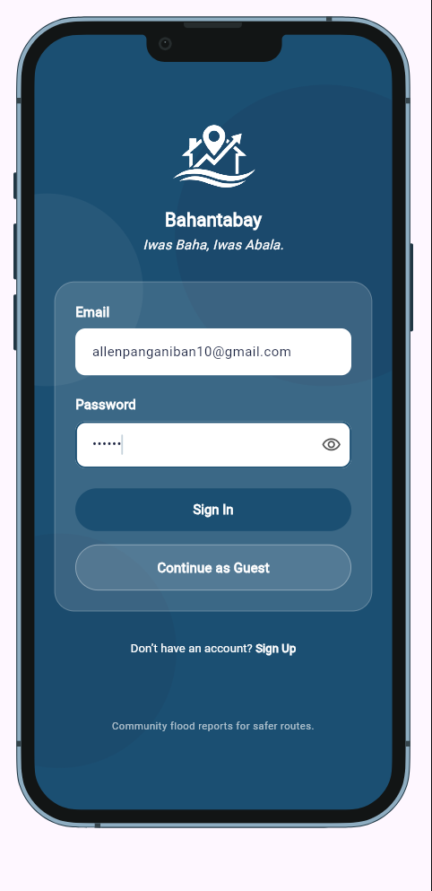
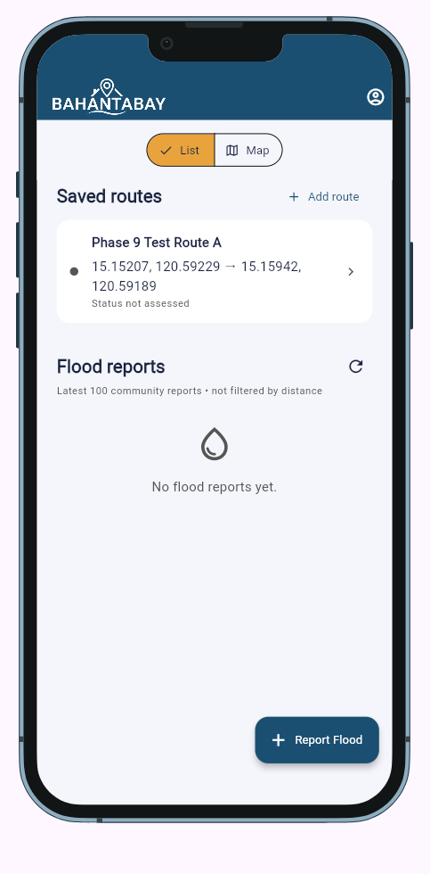
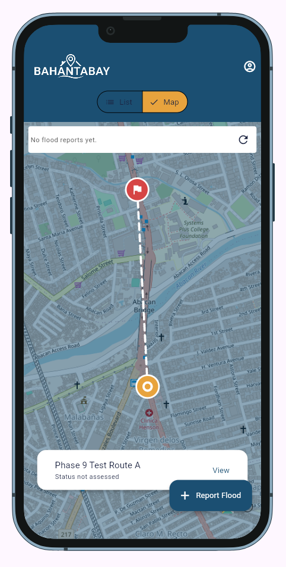
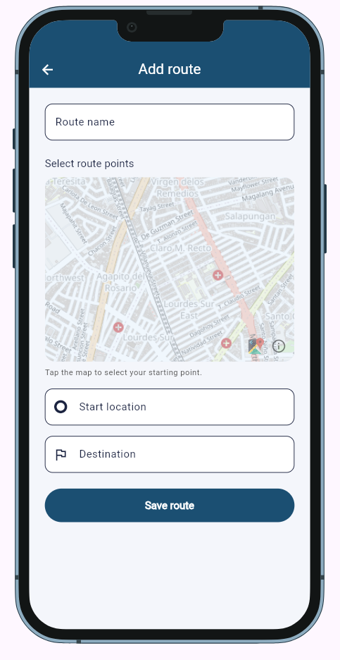
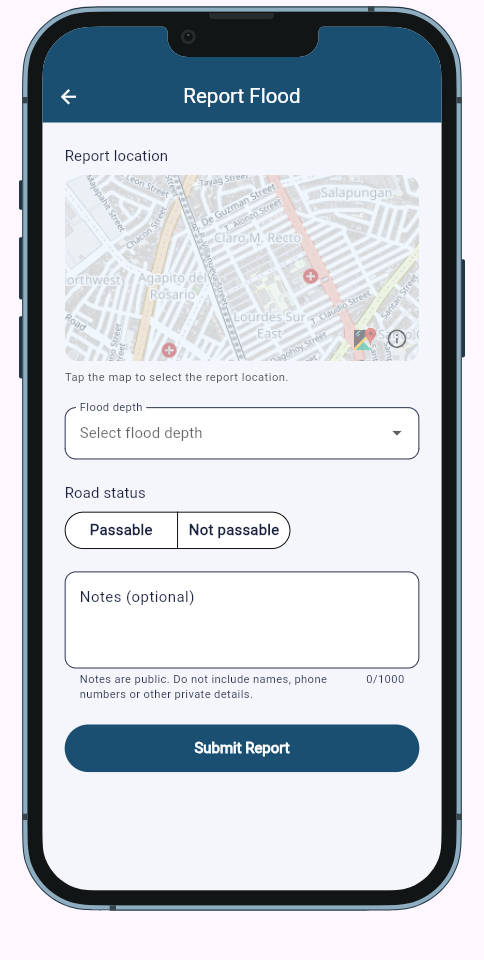

# Bahantabay
[](AI-USAGE.md)

## Overview

Bahantabay is a community flood-monitoring app for commuters in Angeles City and nearby areas. Users can save private two-point routes and view community flood reports; authenticated reporting is implemented and manually verified against live Supabase. Route-specific warning calculation is planned and does not work yet.

**Demo link:** https://allen021006.github.io/bahantabay/ (production/authentication verification pending)

**Demo video:** Coming soon

## Current development status

Phase 10 is complete: implemented, automatically tested, manually verified against live Supabase, committed and pushed. Final production deployment verification remains pending.

| Milestone | Status and evidence |
| --- | --- |
| Phase 8 — schema and RLS | Committed as `7be1770` on September 15, 2026. Applied and manually verified by the project owner. |
| Phase 9 — route persistence | Committed as `3a913c8` on September 17, 2026. The owner verified real inserts, database rows, immediate Home refresh, browser-refresh persistence, map coordinates, Account A/B isolation, account switching and Guest read-only behavior. |
| Phase 10 — Report Flood | Complete, committed and pushed as `1bc688d` — `feat: add community flood reporting`. The owner manually verified Account A submission, Home entries/map markers, expected database data and authenticated ownership, refresh persistence, Account B public reads with private-route isolation, and Guest reads with submission blocked. No raw Supabase/database errors were exposed during the verified flow. |

The latest completed automated run reported **43 passing tests** and **no issues from `flutter analyze`**. These are previous implementation results, not a new run for this documentation update.

## Setup and installation

### 1. Install the tools

Use **Flutter 3.44.2 stable**, including **Dart 3.12.2**, plus Git and a modern browser. These versions were confirmed from the installed SDK metadata during this update. Add Flutter's `bin` directory to PATH; check the installation with `flutter --version` and `flutter doctor`.

`pubspec.yaml` declares Dart `^3.8.0`, but the current lockfile requires **Dart >=3.12.0 <4.0.0 and Flutter >=3.44.0**. The broader manifest constraint is not the tested development environment; use the versions above to reproduce it.

### 2. Clone and install dependencies

```sh
git clone https://github.com/Allen021006/bahantabay.git
cd bahantabay
flutter pub get
```

The stack uses Material 3, simple widget state, Supabase Auth/PostgreSQL, `flutter_map`, OpenStreetMap, `latlong2` and `device_preview`. Exact package versions are in [pubspec.lock](pubspec.lock).

### 3. Configure Supabase

Create or use a Supabase project with email/password authentication enabled. For a **new database**, follow the preflight, apply-once migration and RLS tests in [database setup](supabase/README.md). The existing project database has already been applied and verified: **do not rerun its initial migration**.

The schema contains private `routes` and publicly readable `flood_reports`. RLS restricts routes to their owners and report creation to the authenticated reporter. Client report updates/deletes are prohibited. Supabase anonymous sign-in is not used and should remain disabled. If sign-up returns no active session, the app asks the user to confirm their email before signing in.

### 4. Configure the local app

Copy [.env.example](.env.example) to `.env`:

- PowerShell: `Copy-Item .env.example .env`
- macOS/Linux: `cp .env.example .env`

Replace the placeholders locally using your Supabase dashboard:

```dotenv
SUPABASE_URL=https://your-project.supabase.co
SUPABASE_PUBLISHABLE_KEY=your-publishable-key
```

| Variable | Purpose | Source |
| --- | --- | --- |
| `SUPABASE_URL` | Project API URL | Supabase project dashboard |
| `SUPABASE_PUBLISHABLE_KEY` | Client-safe publishable key | Supabase API Keys settings |

`.env` is ignored by Git. `--dart-define-from-file=.env` passes **compile-time definitions** read by `String.fromEnvironment`; the app does not dynamically load `.env`. Stop and rerun after changing configuration.

Never supply a secret/service-role key, database password or private account credentials. The publishable key is visible in a web build; **RLS enforces authorization**, not secrecy of client configuration.

## How to run it

From the repository directory, after configuring `.env`:

```sh
flutter run -d web-server --web-port 8080 --dart-define-from-file=.env
```

Open **http://localhost:8080**. Expect Sign In / Guest Entry inside DevicePreview, or Home if an authenticated session is restored. Keep the terminal running. Guest entry creates no Supabase account, but real public report reads still require valid backend configuration and connectivity.

Development checks:

```sh
flutter analyze
flutter test
```

Automated tests use test doubles/local fixtures without live Supabase credentials. They do not replace manual backend verification.

## Features and usage

The locked MVP contains exactly five screens. Home List/Map are two states of **one Home screen**, Sign Up is an authentication mode, and the account menu is an overlay.

| Screen | Current use |
| --- | --- |
| **1. Sign In / Guest Entry** | Sign in with email/password, switch to Sign Up on the same screen, or continue as Guest. |
| **2. Home** | View private saved routes and public reports; switch List/Map. The account menu supports logout, account switching, or leaving Guest mode to sign in. Guests see labelled demo routes and cannot save routes or report floods. |
| **3. Add Route** | Signed-in users enter a name, select start/destination points on the map, and save. Success returns to Home and refreshes routes. Supabase preserves each owner's private routes. |
| **4. Route Details — planned** | Not implemented. Route-card taps and the map's View action show a placeholder message. |
| **5. Report Flood** | Signed-in users select a map location, Ankle/Knee/Waist/Chest depth, Passable/Not passable, and optional notes. Successful submission returns to Home and reloads reports. Live Supabase verification is complete. |

Reporting validates required inputs, prevents duplicate presses while submitting, and preserves the draft on failure. Notes are public, have a 1,000-character client limit, and must not contain personal information. Home displays coordinates, depth, passability, notes and time without displaying reporter identities.

Home loads the **latest 100 public reports**, newest first, with loading, empty, error/retry and refresh states. There is **no geographic distance filtering**. Report markers show locations; real saved routes display **“Status not assessed”** and are not evaluated against reports.

## Project structure

```text
lib/main.dart                 Supabase initialization and DevicePreview
lib/app/                      Application widget and theme wiring
lib/core/                     Configuration, theme, spacing and shared widgets
lib/features/authentication/  Auth service, session gate and Sign In/Sign Up UI
lib/features/home/            Single Home screen with List and Map states
lib/features/routes/          Models/service, Add Route and route widgets
lib/features/flood_reports/   Models/service, Report Flood and entry widget
supabase/                     SQL migration, RLS tests and setup guide
test/                         Model, service and widget tests; test helpers
docs/                         Proposal, mockups, design and progress records
docs/assets/                  Design assets, mockups and current runtime captures
.github/workflows/            GitHub Pages build/deployment
```

Route Details has no implemented screen yet. The unused course starter remains under `lib/features/starter/`.

## Screenshots

### Runtime screenshots

These captures show the actual current application: four implemented screens, including both presentation states of Home. They are runtime UI evidence, not proof of successful backend operations.

#### Sign In / Guest Entry



#### Home

| List | Map |
| --- | --- |
|  |  |

#### Add Route



#### Report Flood



Report Flood is implemented and manually verified against live Supabase. This capture shows the form; backend verification was performed separately.

Route Details is not included in the runtime captures because the screen is not implemented yet. Its runtime screenshot will be added after implementation.

### Approved design mockups — not runtime evidence

| Sign In / Guest Entry | Home — List | Home — Map |
| --- | --- | --- |
|  |  |  |

Additional mockups: [Add Route](docs/assets/Add%20Route.png), [Route Details](docs/assets/Route%20Details.png), and [Report Flood](docs/assets/Report%20Flood.png). These show design intent, not proof that all features work.

## Known issues and next steps

- Route Details and route-status calculation are not implemented; saved routes show “Status not assessed.”
- Routes use a straight two-point line, not road-following geometry or navigation.
- No geocoding or device-location integration exists; select locations manually.
- No photo upload or Supabase Storage exists.
- Home reads only the latest 100 reports, without distance filtering, pagination or automatic realtime updates.
- Clients cannot edit/delete reports. Public API reads include reporter UUIDs and notes, even though the UI hides reporter identities.
- If connectivity drops during submission, check Home before retrying to avoid a duplicate.
- Final production deployment/authentication verification and presentation materials remain unfinished; Route Details will need a runtime screenshot after implementation.

**Remaining MVP/submission work:** implement Route Details; implement route-status logic; verify integration/deployment; finish polish, screenshots, demo video and the security/privacy review.

**Possible post-MVP improvements:** road-following geometry, a startup splash screen, advanced map/location controls, and optional report photos with a separate storage/privacy review. These are separate from remaining required MVP work.

## Deployment and privacy

The [Pages workflow](.github/workflows/deploy-web.yml) runs on pushes to `main` or manual dispatch. Set Pages to **GitHub Actions** and add repository secrets `SUPABASE_URL` and `SUPABASE_PUBLISHABLE_KEY`. The workflow supplies `--dart-define` values and the repository base path; it does not upload `.env`.

Analysis/test failures currently do not block deployment. Verify the build, configuration and Supabase production authentication URL settings before treating the demo as verified. DevicePreview remains enabled in deployed builds.

Do not commit `.env`, privileged keys, passwords, personal information or private user data. See [Security and privacy](docs/06-security-and-privacy.md) for access rules and outstanding checks.

## Project documentation

| Document | Purpose |
| --- | --- |
| [Proposal](docs/01-proposal.md) | Problem, users and approved scope |
| [Mockup and wireframes](docs/02-mockup.md) | Five-screen design and planned flow |
| [Design system](docs/03-design-system.md) | Colors, typography, spacing and components |
| [Weekly reports](docs/04-weekly-reports.md) | Recorded development progress |
| [Demo video](docs/05-demo-video.md) | Recording plan; final video pending |
| [Security and privacy](docs/06-security-and-privacy.md) | Data access and verification checklist |
| [Database setup](supabase/README.md) | Apply-once migration and RLS verification |

## Credits and AI use

## Credits and AI use

Built with Flutter, Supabase, `supabase_flutter`, `flutter_map`, OpenStreetMap, `latlong2` and `device_preview`. Versions are recorded in [pubspec.yaml](pubspec.yaml) and [pubspec.lock](pubspec.lock). Project logos, mockups and design assets are in `docs/assets/`; maps display OpenStreetMap contributor attribution.

AI assistance included **ChatGPT, Claude, and Codex**, with the amount of assistance varying by feature. AI was used for planning, architecture, implementation assistance, debugging, explanations, testing and documentation; substantial AI-generated code is disclosed rather than presented as independently written.

See **[AI-USAGE.md](AI-USAGE.md)** for the detailed development record, corrections to AI-generated output, commit evidence, and authorship breakdown.

## Licence

MIT; see [LICENSE](LICENSE).
