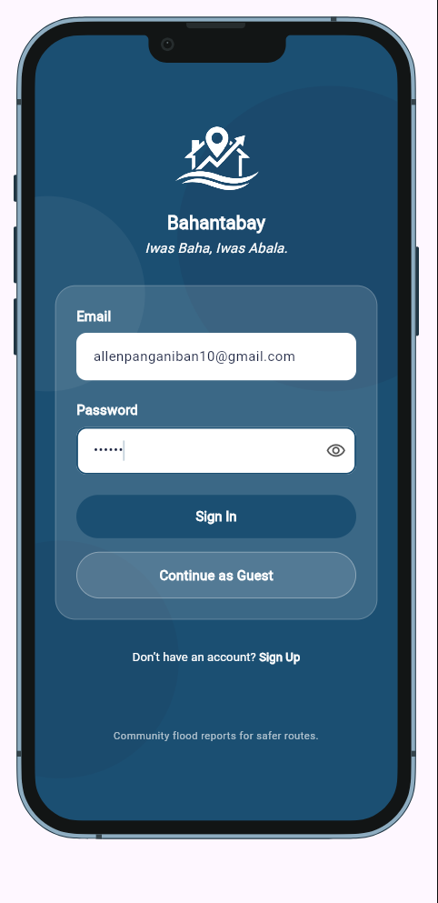
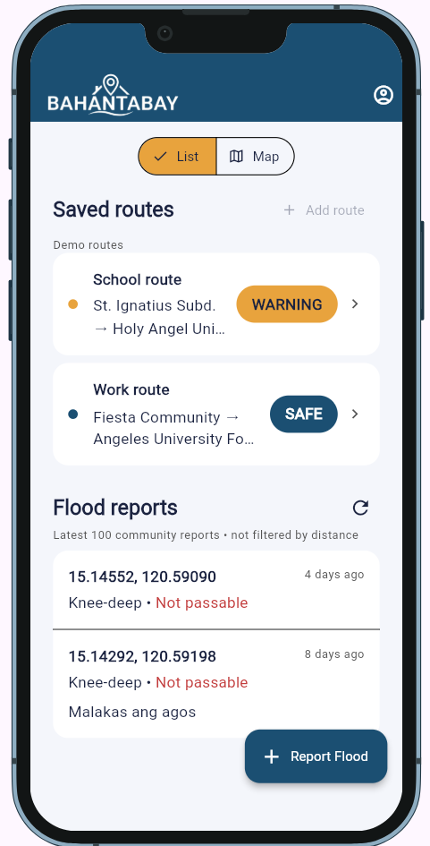
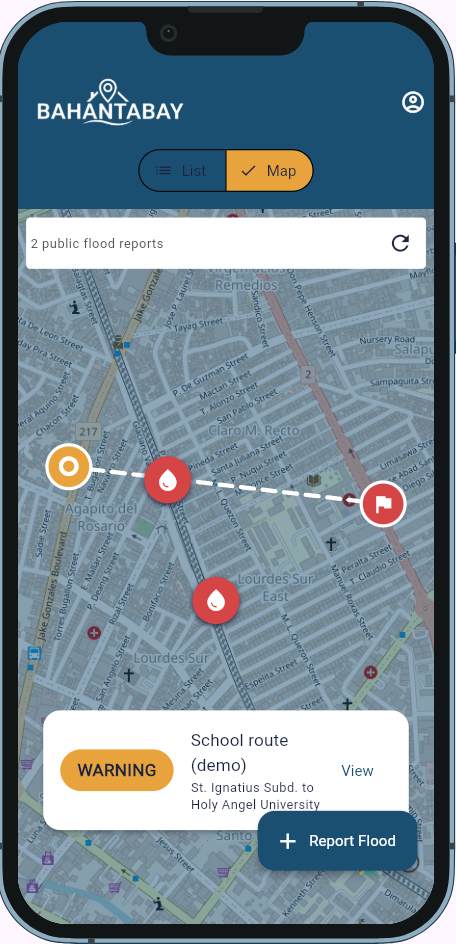
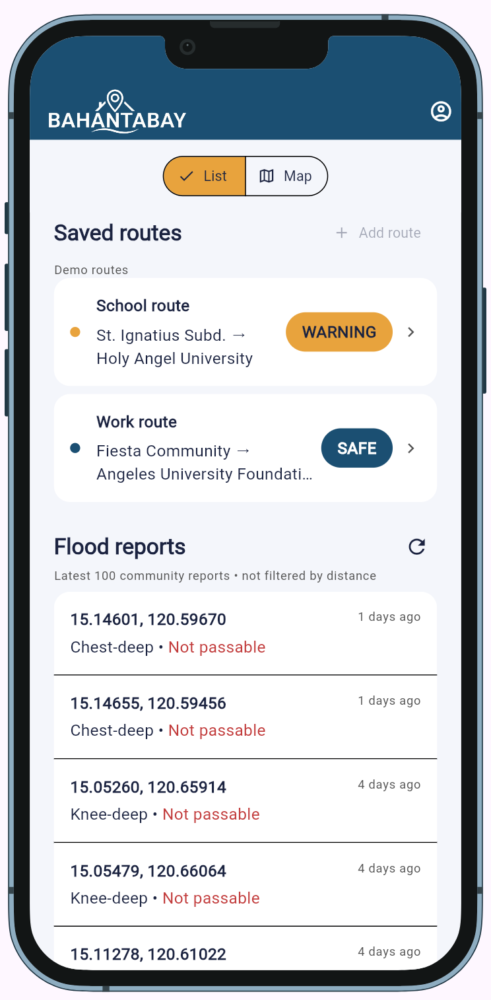
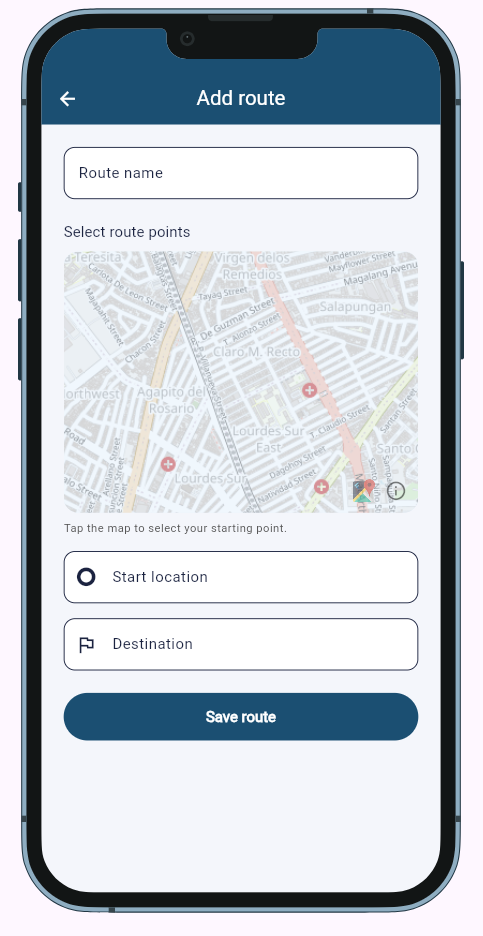
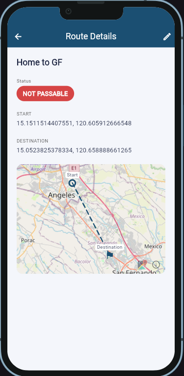
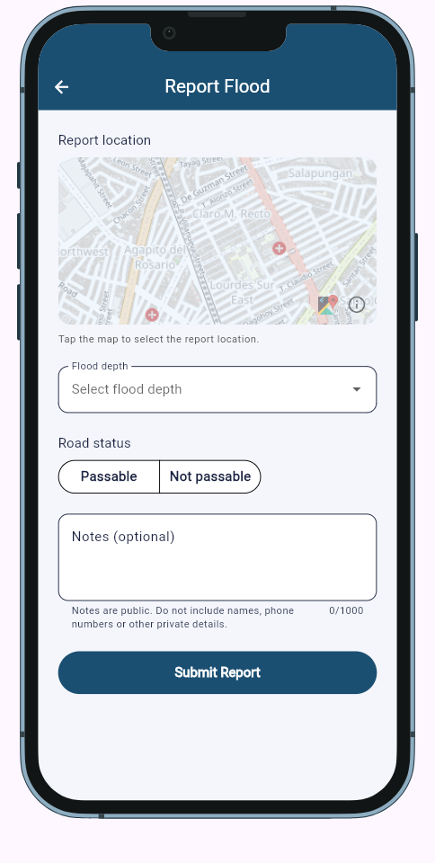

# Bahantabay

[](AI-USAGE.md)

## 1. Overview

Bahantabay is a community-based flood monitoring and route warning application for commuters in Angeles City and nearby areas. It combines private saved routes, public community flood reports, and route-status assessments based on currently loaded reports. Users can manage routes and submit flood observations, while guests can read public reports and explore labelled demonstration routes without creating an account.

- **Public repository:** [Bahantabay on GitHub](https://github.com/Allen021006/bahantabay)
- **Live application:** [Open Bahantabay](https://allen021006.github.io/bahantabay/)
- **Demonstration video:** Pending recording and publication
- **Presentation slides:** In preparation
- **Square image:** [Bahantabay Square Image](https://github.com/Allen021006/bahantabay/blob/310695fe9b7d3f1e4fd83a2d055cbb33af77ca5d/docs/assets/bahantabay-social-square.png)

## 2. Setup and installation

### Step 1 — Install the requirements

The recorded tested development setup is:

- **Flutter 3.44.2 stable**
- **Dart 3.12.2**, included with Flutter
- Git
- A modern web browser
- A Supabase project for authentication and database access

Install Flutter and add its `bin` directory to your PATH. Check the installation:

```sh
flutter --version
flutter doctor
```

The project’s SDK constraints require **Dart >=3.12.0 <4.0.0** and **Flutter >=3.44.0**. The deployment workflow pins Flutter **3.44.2**.

### Step 2 — Clone the repository

```sh
git clone https://github.com/Allen021006/bahantabay.git
cd bahantabay
```

### Step 3 — Install dependencies

```sh
flutter pub get
```

The application uses Material 3, widget-managed state, Supabase Auth and PostgreSQL, `flutter_map`, OpenStreetMap, `latlong2`, and `device_preview`.

Dependency declarations and resolved versions are available in [pubspec.yaml](pubspec.yaml) and [pubspec.lock](pubspec.lock).

### Step 4 — Configure Supabase

Create or use a Supabase project with email/password authentication enabled.

For a **new database**, follow the preflight checks, ordered migrations, and verification instructions in [Database setup](supabase/README.md). These include the restrictions on public flood-report columns.

The existing project database already has both migrations applied. **Do not rerun migrations that have already been applied.**

The schema contains:

- `routes`: private saved routes accessible only to their authenticated owner.
- `flood_reports`: community observations with publicly readable report fields and restricted reporter identity.

Row Level Security enforces route ownership and authenticated report creation. Client updates and deletion of flood reports are prohibited.

Supabase anonymous sign-in is not used and should remain disabled. The application’s Guest mode does not create a Supabase account.

If registration returns no active session, the application asks the user to confirm their email before signing in.

### Step 5 — Configure the local application

Copy [.env.example](.env.example) to `.env`.

PowerShell:

```powershell
Copy-Item .env.example .env
```

macOS or Linux:

```sh
cp .env.example .env
```

Replace the placeholders with your Supabase client configuration:

```dotenv
SUPABASE_URL=https://your-project.supabase.co
SUPABASE_PUBLISHABLE_KEY=your-publishable-key
```

| Variable | Purpose |
| --- | --- |
| `SUPABASE_URL` | Your Supabase project API URL |
| `SUPABASE_PUBLISHABLE_KEY` | Your client-safe Supabase publishable key |

The `.env` file is ignored by Git. `--dart-define-from-file=.env` supplies compile-time definitions read through `String.fromEnvironment`; the application does not dynamically load `.env`.

Stop and restart the application after changing these values.

Never supply a secret/service-role key, database password, or private account credentials. Client configuration is recoverable from a web build. Authorization relies on database policies and privileges, not on hiding the publishable key.

### Optional — Configure GitHub Pages deployment

The [deployment workflow](.github/workflows/deploy-web.yml) runs on pushes to `main` or manual dispatch.

Configure repository Pages to use **GitHub Actions**, then add these repository Actions secrets:

```text
SUPABASE_URL
SUPABASE_PUBLISHABLE_KEY
```

The workflow:

- Uses Flutter **3.44.2**.
- Pins external actions to full commit SHAs.
- Runs analysis and tests before building.
- Supplies the Supabase configuration through Dart definitions.
- Builds with the `/bahantabay/` base path.
- Uploads `build/web` rather than the local `.env` file.

Analysis errors, fatal warnings, and test failures block deployment. The workflow uses `flutter analyze --no-fatal-infos`, so informational diagnostics alone do not block it.

The build fails before compilation if either required Supabase value is empty, without printing the value. This does not prove that a nonempty value is correct.

If deploying under a different repository name, update the workflow’s web base path to match its GitHub Pages URL.

## 3. How to run it

After configuring `.env`, run this command from the repository directory:

```sh
flutter run -d web-server --web-port 8080 --dart-define-from-file=.env
```

Open [http://localhost:8080](http://localhost:8080) and keep the terminal running.

After the animated startup splash, the application displays Sign In / Guest Entry inside DevicePreview, or Home when an authenticated session is restored.

A fresh page load defaults to the **iPhone 13 Pro Max** preview. Visitors can change the device or orientation through the preview toolbar. Preview preferences reset independently of the Supabase sign-in session.

Guest entry creates no Supabase account. Reading real public flood reports still requires valid backend configuration and an internet connection.

### Development checks

```sh
flutter analyze
flutter test
git diff --check
```

The final audit-remediation validation recorded:

- No Flutter analysis issues.
- **99 passing automated tests**.
- A successful release web build using the `/bahantabay/` base path.
- Both Material and Cupertino icon fonts included without the earlier missing-font warning.
- No whitespace errors from `git diff --check`.

These results apply to the recorded validation run. Automated tests use test doubles and local fixtures; they do not replace live Supabase or deployment checks.

## 4. Features and usage

The MVP contains exactly **five functional screens**. Home List and Map are two states of one screen. Sign Up is a mode of the authentication screen, and the account menu is an overlay.

The animated startup splash is a temporary presentation state. Editing a route reuses Add Route rather than adding another screen.

### Screen 1 — Sign In / Guest Entry

Sign in with an email address and password, switch to Sign Up to create an account, or continue as Guest.

Guests can read public flood reports and explore labelled demonstration routes in List and Map views.

Guest mode:

- Does not fetch private saved routes.
- Does not allow route creation, editing, deletion, or flood-report submission.
- Hides the Report Flood button.
- Keeps demonstration routes outside the private Route Details flow.
- Uses demonstration statuses that are distinct from live assessment of authenticated users’ saved routes.

### Screen 2 — Home

After signing in, Home displays the account’s private saved routes and public community flood reports.

Use the **List / Map** selector to switch between the two presentation states. The account menu supports logout, account switching, and leaving Guest mode to sign in.

Home Map lets signed-in users choose a route through the bottom route card when multiple saved routes are available. The saved-route list opens above the card, and the separate **View** action opens the selected route’s details.

Home fetches the **latest 100 public reports globally**, newest first. It provides loading, empty, error/retry, and refresh states.

The fetch is not geographically filtered. Route assessment checks the loaded collection against each real saved route.

Public report content includes location coordinates, flood depth, road status, notes, and creation time. Reporter identities are not displayed or available through the public SELECT projection.

### Screen 3 — Add Route

Signed-in users enter a route name, select start and destination points on the map, and save a private route.

Successful creation returns to Home and reloads routes. Supabase preserves each account’s routes between sessions.

The same screen supports editing an existing route with its name and endpoints already filled in. It also provides deletion with confirmation.

Successful editing or deletion returns to Home and reloads routes for reassessment. Leaving the editor without saving preserves the existing route.

### Screen 4 — Route Details

Open a real saved route from the Home List or the Map card’s **View** action.

Route Details displays:

- Route name.
- Start and destination coordinates.
- A map showing the saved endpoints and connecting segment.
- The status supplied by Home.

Use the pencil action to open the route editor.

An open Route Details screen retains its navigation-time status snapshot. It does not independently fetch reports or recalculate the assessment.

### Screen 5 — Report Flood

Signed-in users select:

- A location on the map.
- Ankle, Knee, Waist, or Chest flood depth.
- Passable or Not passable road status.
- Optional public notes.

The form validates required inputs before writing data. While submission is pending, it disables repeated submission and prevents Back navigation from closing the form.

Successful submission returns a result to Home, which reloads the reports and reassesses saved routes. Failures preserve the draft and display an error message.

Notes are public, have a 1,000-character client limit, and must not include personal information.

If connectivity drops during submission, check Home before retrying because the server may have saved the report even if the client did not receive confirmation.

### How route status works

A report is relevant when it lies within **200 meters of the bounded straight-line segment** between a saved route’s start and destination.

| Status | Meaning |
| --- | --- |
| **SAFE** | Reports loaded successfully, and no relevant severity-raising report was found. |
| **WARNING** | A relevant report marks the location as passable. |
| **NOT PASSABLE** | A relevant report marks the location as not passable. This takes priority over WARNING. |

Loading or failed retrieval remains **Status not assessed**, never SAFE.

Refreshing reports or successfully submitting a report causes Home to derive statuses again. Status is calculated rather than stored as a separate database field.

The distance calculation approximates coordinates in local meters and measures proximity to a bounded segment. It does not treat the route as an infinitely extended line.

**SAFE does not guarantee real-world road safety.** Assessment is limited to loaded community reports. Flood depth does not independently determine severity, and reports currently have no expiry or resolution rule.

### Responsive presentation

At widths of at least **800 logical pixels**, Home Map uses compact left-side panels. Other screens constrain content width and allow scrolling on short viewports.

The compact desktop layout was tested at approximately **810 × 375 logical pixels**, corresponding to a **1620 × 750 physical-pixel preview at 2× scaling**.

DevicePreview intentionally remains enabled in the public demonstration. The web page uses Bahantabay branding, does not force portrait orientation, and allows browser zoom.

## 5. Project structure

```text
lib/main.dart                 Supabase initialization and DevicePreview
lib/app/                      Application widget and theme wiring
lib/core/                     Configuration, layout, theme and shared widgets
lib/features/authentication/  Auth service, session gate and Sign In/Sign Up UI
lib/features/home/            Home screen with List and Map states
lib/features/routes/          Models, service, calculator and route screens
lib/features/flood_reports/   Models, service, report form and report entries
lib/features/splash/          Startup animation and transition gate
supabase/                     SQL migrations, verification and setup guide
test/                         Model, service and widget tests
docs/                         Proposal, design, progress and verification records
docs/assets/                  Branding, mockups and recorded runtime captures
.github/workflows/            GitHub Pages build and deployment
```

Important implementation files:

| File | Responsibility |
| --- | --- |
| `lib/features/authentication/presentation/auth_gate.dart` | Tracks authentication and Guest state and replaces account-specific navigation when the session changes. |
| `lib/features/home/presentation/screens/home_screen.dart` | Holds Home’s view selection, loaded routes and reports, selected route, and loading/error state. |
| `lib/features/routes/domain/saved_route.dart` | Saved-route data model. |
| `lib/features/routes/domain/route_status_calculator.dart` | Calculates route status from nearby loaded flood reports. |
| `lib/features/routes/data/route_service.dart` | Fetches and changes authenticated users’ saved routes. |
| `lib/features/flood_reports/domain/flood_report.dart` | Public report and submission-draft models. |
| `lib/features/flood_reports/data/flood_report_service.dart` | Fetches public report fields and submits authenticated reports. |
| `lib/core/layout/content_inset.dart` | Shared content-width spacing for responsive layouts. |

State is managed through Flutter widgets and injected service interfaces. Models and route-assessment logic are separated from the screen widgets and backend services.

## 6. Screenshots

### Recorded runtime screenshots

The following images cover the five functional screens, including both Home presentation states. They are recorded runtime captures, not proof of backend operations.

**Some captures predate the latest interface changes.** In particular, older Guest Home screenshots still show the former Report Flood button. The current implementation hides that action. Refreshed screenshots of the final Guest view, route chooser, and responsive layouts remain pending.

### Screen 1 — Sign In / Guest Entry



### Screen 2 — Home

| List | Map |
| --- | --- |
|  |  |

### Guest View


### Screen 3 — Add Route



### Screen 4 — Route Details



### Screen 5 — Report Flood



This capture shows the report form. Authenticated submission and persistence were verified separately against live Supabase.

### Approved design mockups

These images show the approved design direction rather than the final implementation or backend behavior.

| Sign In / Guest Entry | Home List | Home Map |
| --- | --- | --- |
|  |  |  |

Additional mockups:

- [Add Route](docs/assets/Add%20Route.png)
- [Route Details](docs/assets/Route%20Details.png)
- [Report Flood](docs/assets/Report%20Flood.png)

## 7. Known issues and next steps

### Current implementation and verification status

The five-screen MVP is implemented. The project owner has manually verified authentication, Guest restrictions, private saved routes, route selection, editing and deletion, public flood reports, authenticated reporting, report persistence, and phone and compact desktop previews.

The final audit remediation in `8920448` passed Flutter analysis, all **99 automated tests**, and a release web build. The owner subsequently confirmed successful deployment and live application checks, including Back-navigation protection during report submission.

The latest Guest-interface changes are:

- `ece0817` — removed the unavailable Report Flood button from Guest mode.
- `bc6b05f` — corrected an AuthGate test that still expected the old disabled button.

The first Guest-button deployment run failed on that outdated test assertion. The follow-up correction is committed; successful deployment of that correction and the latest live Guest view still need a recorded confirmation.

### Current limitations

- Routes use straight two-point segments rather than road-following geometry or navigation.
- The 200-meter proximity threshold is an MVP heuristic.
- Coordinate conversion is an approximation intended for short local routes.
- Assessment uses only the latest 100 loaded public reports.
- There is no report pagination, geographic filtering of the fetch, or automatic realtime subscription.
- Reports have no expiry, resolution, or freshness-based exclusion rule.
- Flood depth does not independently determine route severity.
- Locations are selected manually; there is no geocoding or device-location integration.
- There is no photo upload or Supabase Storage integration.
- Clients cannot edit or delete submitted flood reports.
- A dropped connection can leave submission success uncertain; users should check Home before retrying.

### Final submission work

- Record confirmation of the latest successful deployment and Guest-button behavior.
- Refresh runtime screenshots and review them for private information.
- Finalize the presentation slides.
- Record the three-to-five-minute demonstration, including the required two-to-three-minute AI-use segment.
- Publish and test the video and slide links.
- Add the prepared 1080 × 1080 promotional image to the submission assets.
- Reconcile remaining documentation and AI-authorship inconsistencies.
- Complete the final security, privacy, licensing, and submission review.

The presentation, video, refreshed screenshots, and submission review remain in progress. The square promotional image has been created locally and is awaiting inclusion in the submission assets.

### Possible future improvements

- Road-following route geometry.
- Automatic or improved map-based location selection.
- Report expiry and visible freshness indicators.
- Optional photo evidence with privacy and moderation controls.
- More field testing with real commuting scenarios.

These are future improvements and are not presented as implemented MVP features.

## Security checklist

**Last updated: October 1, 2026**

## Secrets and credentials

| # | Check | Yes / No / N/A | Evidence |
| --- | --- | --- | --- |
| 1 | No API key, token or password is hardcoded in `lib/`, including in comments and commented-out code | Yes | Inspection of `lib/` found environment-variable references and authentication logic, with no hardcoded credential values. |
| 2 | Anything private is in a gitignored config or passed with `--dart-define`, with an example file committed | Yes | `.env` is gitignored, `.env.example` contains placeholders, and the client configuration is supplied through Dart definitions. |
| 3 | No keystore, `key.properties` or signing credential is in the repository | Yes | Tracked-file and reachable-history checks found no keystore, `key.properties`, private key, or signing credential. |
| 4 | Git history is clean: I searched `git log -p` for password, secret, api key and token | Yes | The final reachable-history scan found expected security-related terms in source code and documentation but no high-confidence privileged credential or private-key pattern. It also confirmed that `.env` has no committed history. |
| 5 | Any credential that was ever committed has been rotated | Not applicable | No committed credential requiring rotation was identified. |

## GitHub Actions

| # | Check | Yes / No / N/A | Evidence |
| --- | --- | --- | --- |
| 6 | No secret value is written literally in any workflow YAML file | Yes | `.github/workflows/deploy-web.yml` references repository secrets and contains no literal Supabase credential value. |
| 7 | Secrets are stored in repository Actions secrets and read with `${{ secrets.NAME }}` | Yes | The deployment workflow reads `SUPABASE_URL` and `SUPABASE_PUBLISHABLE_KEY` through GitHub Actions secret references. |
| 8 | No workflow step echoes, dumps or debug-printss a secret, and I opened a recent run’s log to confirm | Yes | The workflow contains no secret-printing or environment-dump command. I opened the latest workflow logs while investigating the Guest-mode test failure. The output contained Flutter test diagnostics and the public OpenStreetMap warning, with no Supabase secret value or private credential printed. |
| 9 | If I build a signed APK: the keystore is a base64 secret decoded to a file at build time, never printed | Not applicable | The current production workflow builds Flutter web for GitHub Pages and does not build a signed APK. |
| 10 | Uploaded build artifacts contain no key file, keystore or generated config | No | The workflow uploads only `build/web`, and no key or keystore is intentionally generated. Inspection of the downloaded GitHub Pages artifact itself has not yet been recorded. |
| 11 | Third-party actions are pinned to a commit SHA, not a movable tag | Yes | Every external action reference in `deploy-web.yml` uses a full verified commit SHA with a readable version comment. |
| 12 | Secret scanning and push protection are enabled on the repository | Yes | I manually confirmed GitHub Secret Protection and Push Protection, as recorded in the public `AI-USAGE.md`. |

## Backend and security rules

| # | Check | Yes / No / N/A | Evidence |
| --- | --- | --- | --- |
| 13 | Firestore and Storage rules are not left open to anyone; they require an authenticated user | Not applicable | Bahantabay uses Supabase PostgreSQL and Auth. Firestore and file Storage are not part of the current application. |
| 14 | Rules restrict a user to their own documents where that makes sense | Yes | Saved-route Row Level Security restricts route access and changes to the authenticated owner. Community flood-report fields are intentionally public, while the internal reporter identifier is restricted. |
| 15 | If Supabase: Row Level Security is on for every table | Yes | The `routes` and `flood_reports` tables both enable RLS. This was checked in the migration definitions and manually verified against the live Supabase project. |
| 16 | Firebase and Google API keys are restricted in the Google Cloud console to the APIs and app they are for | Not applicable | The application uses Supabase and OpenStreetMap rather than Firebase or Google API keys. |
| 17 | I opened the app signed out and confirmed I could not read or write data I should not | Yes | Manual Guest checks confirmed that public flood reports and demonstration routes remained readable while private routes, route creation, route editing, route deletion, and report submission were unavailable. The Report Flood button is now completely hidden in Guest mode. |
| 18 | Seed and sample data is invented, not real people’s data | Yes | Guest demonstration routes and automated test fixtures use fictional or generic data rather than real personal records. |

## Input and app surface

| # | Check | Yes / No / N/A | Evidence |
| --- | --- | --- | --- |
| 19 | Input is validated before it is written, not only styled as valid in the UI | Yes | Route and flood-report forms validate their values before submission. SQL constraints and RLS provide additional database-side validation and ownership enforcement. |
| 20 | Nothing secret is recoverable from the built app, since a shipped binary can be unpacked | Yes | The web application uses only the intended client-safe Supabase URL and publishable key. No service-role key, database password, signing key, `.env` file, or privileged credential was found in the application source or reachable Git history. Database security does not depend on hiding the publishable client configuration; RLS and column privileges enforce access. |

## Repository and privacy

| # | Check | Yes / No / N/A | Evidence |
| --- | --- | --- | --- |
| 21 | No student number, personal email, phone number or home address is in the repository or in commit messages | No | Text-based checks found no confirmed exposure requiring removal. Final screenshots, presentation exports, the demonstration video, and the square project image still require a visual privacy review. Git author metadata is excluded under the professor’s clarification. |
| 22 | No classmate’s personal data is in the repository | No | No classmate data is known in the reviewed source code, documentation, or fixtures. The final visual materials still require review before this can be marked complete. |
| 23 | Dependencies come from pub.dev, and `build/` and `.dart_tool/` are gitignored | Yes | Non-SDK Flutter dependencies resolve through `pub.dev` in `pubspec.lock`. `.gitignore` excludes `build/` and `.dart_tool/`. |
| 24 | Images, fonts and other assets are mine, licensed, or credited | No | OpenStreetMap attribution is displayed and package-provided fonts are declared through Flutter dependencies. The final presentation images, video assets, and 1080 × 1080 project image still need a complete ownership, licence, and attribution review. |
| 25 | Repository visibility is deliberate, and I checked it after my last push | Yes | The Bahantabay repository is intentionally public. I opened its GitHub page and recent GitHub Actions output after the latest push. The public repository and deployed application links are accessible. |

## Additional database verification

The complete rollback-only SQL verification was run against the live database without rerunning any migration. It returned its final PASS result and rolled back its test fixtures.

Direct REST checks were also completed with the public client configuration:

| Request | Guest result | Authenticated result |
| --- | --- | --- |
| Select the seven approved public flood-report columns | Allowed | Allowed |
| Select `reporter_id` | Denied | Denied |
| Select wildcard `*` | Denied | Denied |

No secret key, service-role key, or database password was used for these checks.

## Anything I found and fixed

The security audit found that public flood-report SELECT access unnecessarily exposed the internal `reporter_id`, even though Flutter did not display it. The client now requests only the seven intended public fields. A later migration restricts anonymous and authenticated SELECT access to those fields while preserving authenticated INSERT ownership and RLS. I manually applied and verified this change.

The audit also found that pressing Back during a pending flood-report submission could close the form before Home received the successful result. The form now blocks Back navigation while submission is unresolved. A regression test confirms that the form remains open until completion and that Home refreshes once after success.

External GitHub Actions were pinned to verified commit SHAs. The deployment workflow is pinned to Flutter 3.44.2, matching the final tested environment.

The missing Cupertino icon-font warning was resolved by declaring the required dependency. The final release web build included both Material and Cupertino icon fonts.

Guest mode originally displayed a disabled Report Flood button. Because guests cannot submit reports, the action is now absent from both Guest List and Map views. The Home and AuthGate tests were updated to verify this behavior.

## Remaining security and privacy checks

Before final submission, I still need to:

- Download or inspect the final uploaded GitHub Pages artifact and confirm that it contains no key file, keystore, `.env` file, or unintended generated configuration.
- Review every final screenshot, slide, PDF, video frame, and project image for student numbers, personal email addresses, phone numbers, home addresses, classmate data, session details, and private backend information.
- Confirm ownership, licensing, and attribution for every final image, font, logo, screenshot, map capture, and media asset.
- Repeat the repository visibility and deployed-link check after the final documentation and presentation-material push.

### Access controls

Supabase Row Level Security separates private saved routes from public community flood reports.

Authenticated users can submit reports tied to their own identity. Guests can read public report fields but cannot submit reports or access private saved routes.

The public flood-report SELECT projection contains:

```text
id
latitude
longitude
flood_depth
road_status
notes
created_at
```

The internal `reporter_id` remains in the database for ownership enforcement but cannot be selected by either client role. It is excluded from the public `FloodReport` model.

The project owner manually applied and verified the [public-column privacy migration](supabase/migrations/20260923000000_restrict_flood_report_public_columns.sql).

### Completed verification

The owner manually checked authentication, session restoration, private-route persistence, account switching, owner isolation, Guest restrictions, route editing and deletion, and public-report submission and persistence.

The complete rollback-only SQL verification returned its final PASS result and rolled back its test fixtures. No already-applied migration was rerun.

Direct REST checks confirmed:

| Request | Guest client | Authenticated client |
| --- | --- | --- |
| Select the seven approved public flood-report columns | Allowed | Allowed |
| Select `reporter_id` | Denied | Denied |
| Select wildcard `*` | Denied | Denied |

These checks used client-safe configuration and an ordinary authenticated session, not a secret or service-role key.

A reachable-history scan found no high-confidence privileged-key or private-key pattern and no committed `.env` file. This is recorded evidence, not a guarantee that every possible credential format or privacy issue has been ruled out.

Final workflow-log, uploaded-artifact, media-privacy, and asset-licensing reviews remain separate submission checks.

Do not commit `.env`, privileged credentials, passwords, or private user data.

## AI usage

**AI credit:** ChatGPT, Claude, and Codex assisted with planning, explanations, implementation, debugging, testing, review, and documentation. The amount and type of assistance varied by feature.

The repository includes [AI-USAGE.md](AI-USAGE.md), which records feature-level assistance, authorship, corrections, and supporting commit evidence. It must remain current as the project and submission materials change.

## Project documentation

| Document | Purpose |
| --- | --- |
| [Proposal](docs/01-proposal.md) | Problem, intended users and approved scope |
| [Mockup and wireframes](docs/02-mockup.md) | Five-screen design and planned flow |
| [Design system](docs/03-design-system.md) | Colors, typography, spacing and components |
| [Weekly reports](docs/04-weekly-reports.md) | Development progress |
| [Demo video](docs/05-demo-video.md) | Recording plan and video status |
| [Security and privacy](docs/06-security-and-privacy.md) | Data access rules and verification evidence |
| [Final audit](docs/07-final-audit.md) | Audit findings and subsequent remediation |
| [Database setup](supabase/README.md) | Migration and database verification instructions |
| [AI usage](AI-USAGE.md) | AI assistance and feature-level authorship records |

## Technology and asset credits

Built with Flutter, Dart, Supabase, `supabase_flutter`, `flutter_map`, OpenStreetMap, `latlong2`, `device_preview`, and `cupertino_icons`.

Package versions are recorded in [pubspec.yaml](pubspec.yaml) and [pubspec.lock](pubspec.lock). The application displays OpenStreetMap contributor attribution. Project branding and design assets are stored in `docs/assets/`.

## Licence

MIT. See [LICENSE](LICENSE).
